# Schema
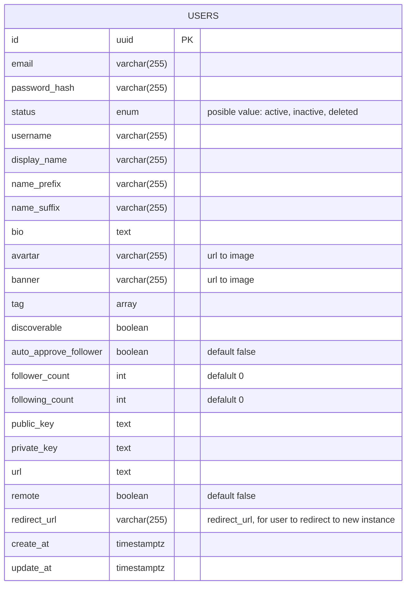

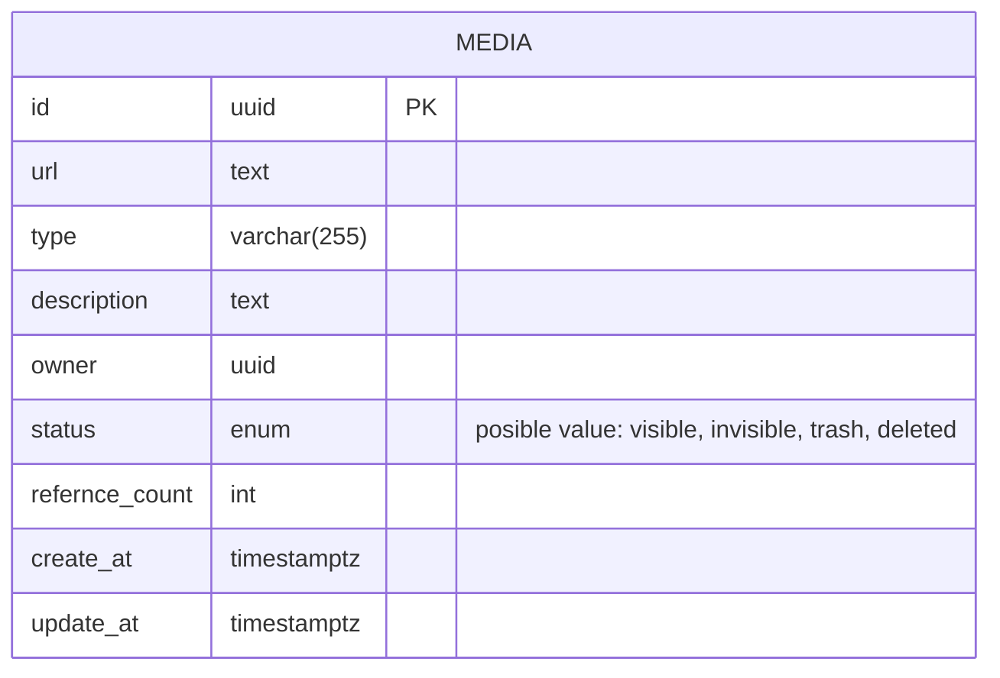

# Relations
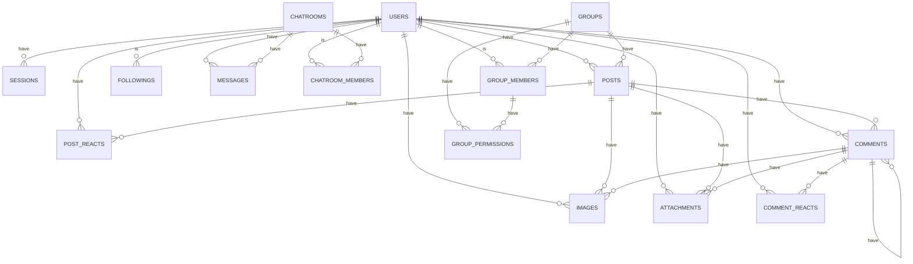

# Refernce by

## USERS
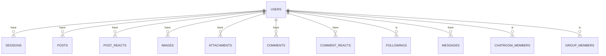

## POSTS
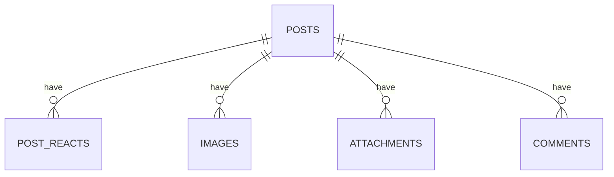

## COMMENTS
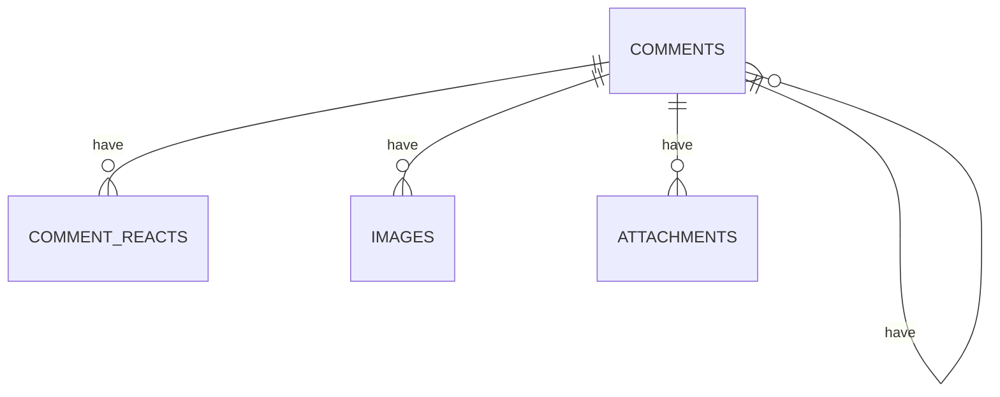

## GROUPS
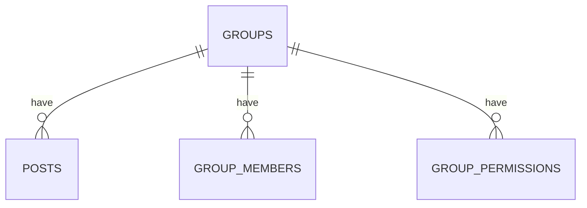

## GROUP_MEMBERS
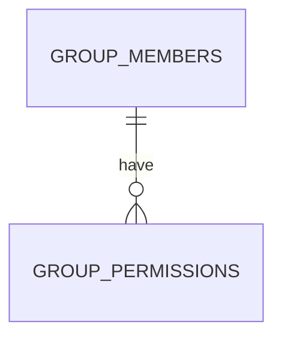

## CHATROOMS
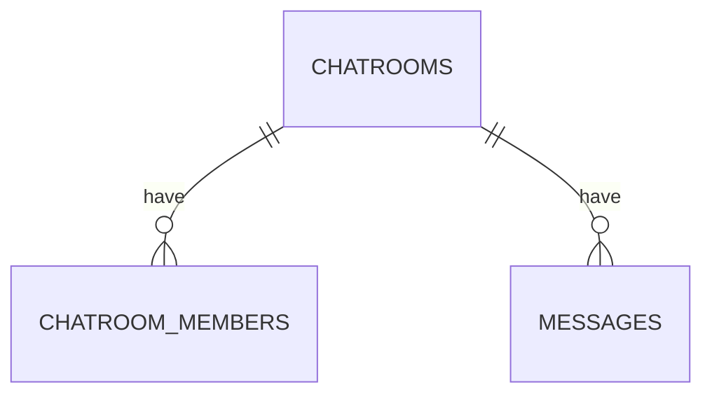

# Refernce

## SESSIONS
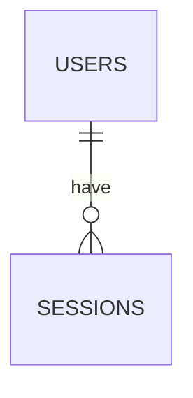

## POSTS
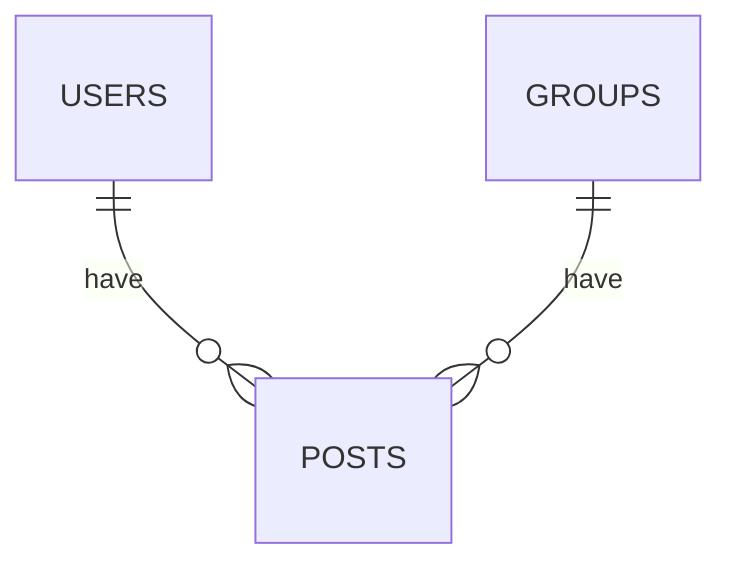

## POST_REACTS
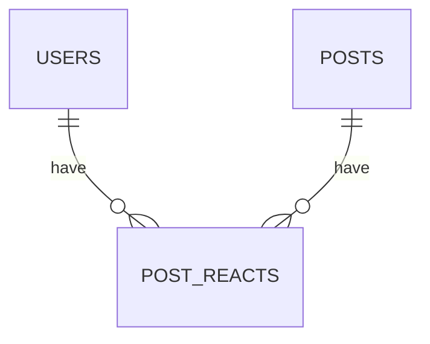

## IMAGES
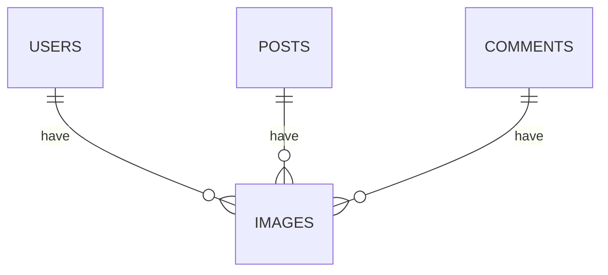

## ATTACHMENTS
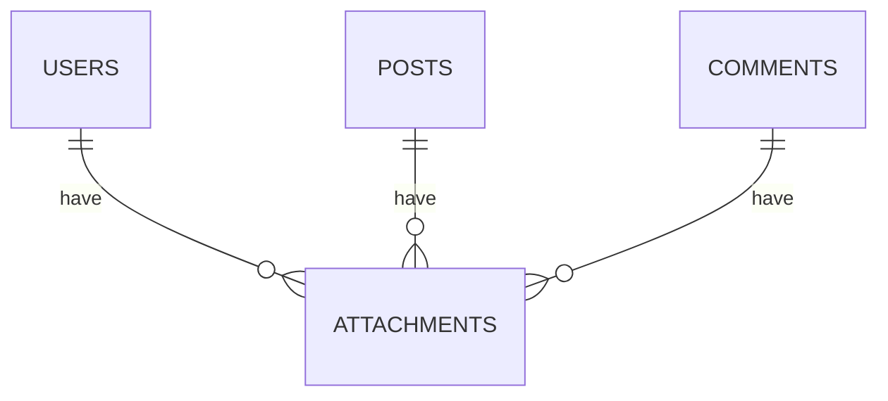

## COMMENTS
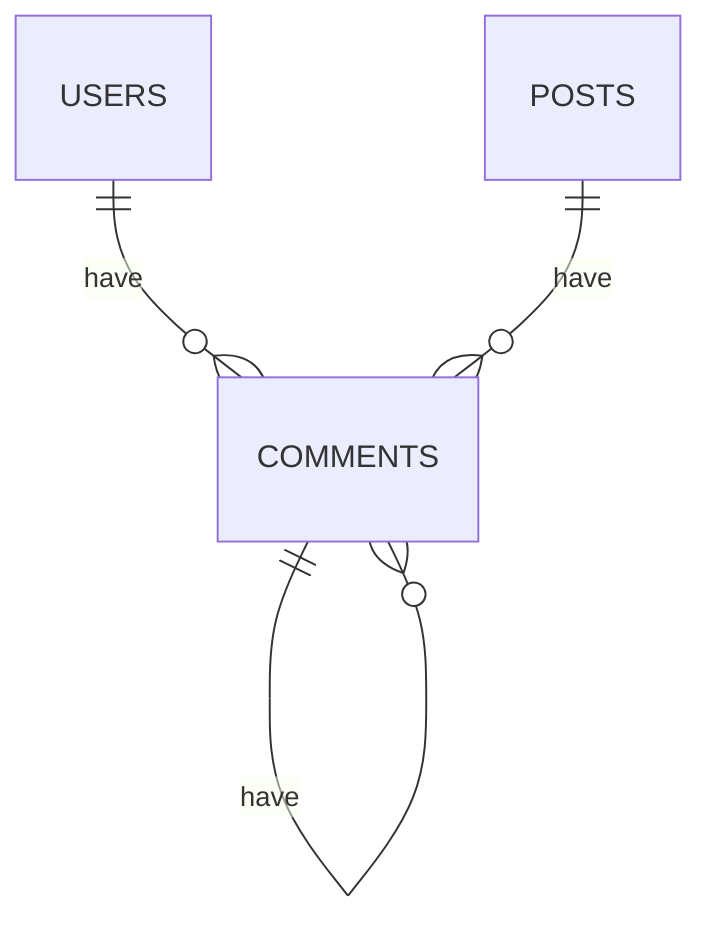

## COMMENT_REACTS
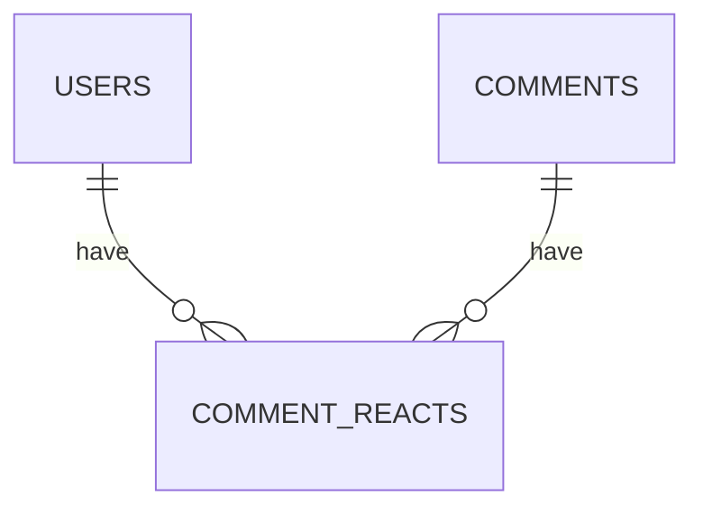

## FOLLOWINGS
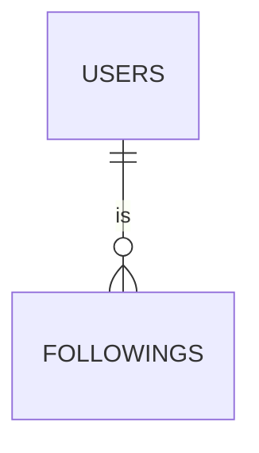

## MESSAGES
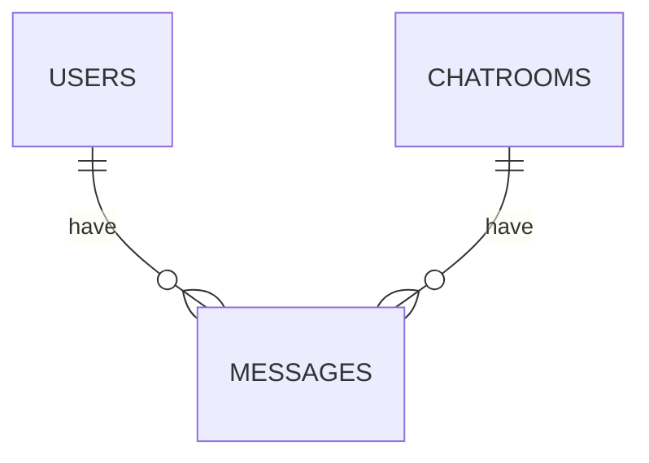

## CHATROOM_MEMBERS
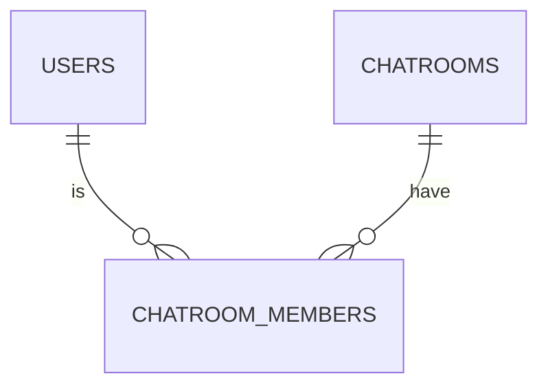

## GROUP_MEMBERS
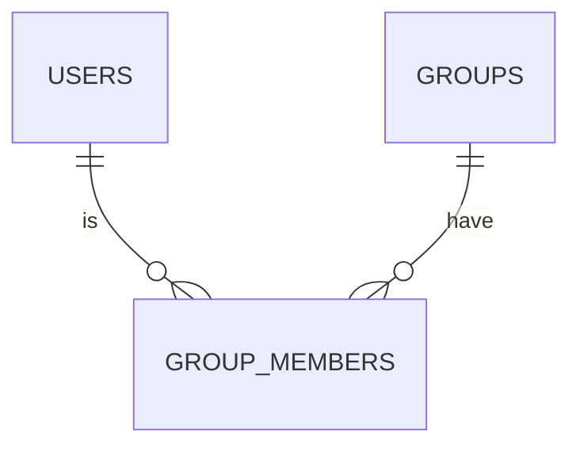

## GROUP_PERMISSIONS
```mermaid
erDiagram
GROUPS ||--o{ GROUP_PERMISSIONS: have
GROUP_MEMBERS ||--o{ GROUP_PERMISSIONS: have
```
